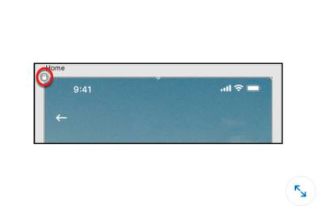
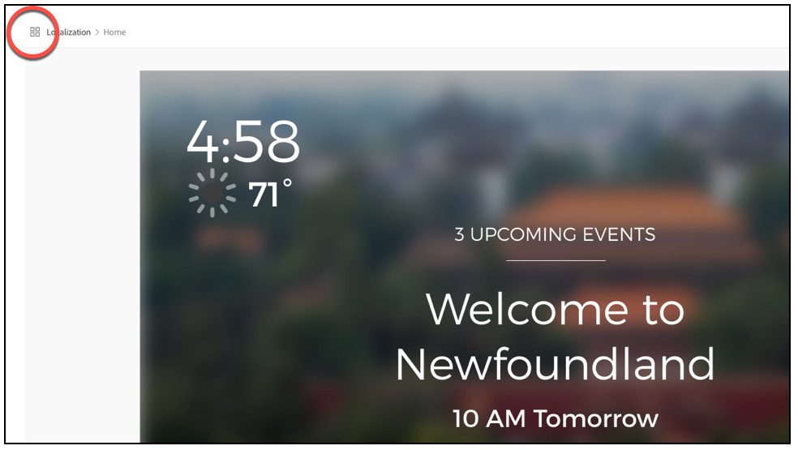

## Adobe XD

#### Q1. Where was this `Lock` icon applied?

- [ ] in the `Components` panel
- [x] in the `Layers` panel
- [ ] in the `Property Inspector`
- [ ] in Share mode

#### Q2. In this figure, which value represents the bottom margin of the layout grid?

- [ ] 30
- [x] 20
- [ ] 43
- [ ] 0

#### Q3. What does clicking the circled icon enable you to do?

- [ ] Change the trigger.
- [ ] Choose a destination.
- [ ] Add a new interaction.
- [x] Add a new state.

#### Q4. You want to share your project to a blog or social media. How would you accomplish this?

- [x] Link to the project from your Creative Cloud account.
- [ ] Use the prototype link.
- [ ] Add the prototype link to a blog.
- [ ] Add your social media accounts to your invitation list.

#### Q5. You need to have a keyboard appear when a text area is tapped. Which action type should you apply?

- [ ] Auto-Animate
- [x] Overlay
- [ ] Previous Artboard.
- [ ] Transition.

#### Q6. How do you stop guides from snapping to objects on the artboard?

- [ ] Press Option (Mac) or Alt (Windows) when dragging the guide.
- [x] Press Command (Mac) or Ctrl (Windows) when dragging the guide.
- [ ] Press the Shift key when dragging the guide.
- [ ] Drag the guide to its location on the artboard.

#### Q7. Your developer notifies you that the left alignment of some the text in a slide in menu is off by 2 pixels. How did the developer catch this?

- [x] The distance values are shown in the developer's share screen.
- [ ] The developer rolled over them in the developer's share screen.
- [ ] The differing values were noted in the CSS.
- [ ] Artboard guides appear in the developer's share screen.

#### Q8. How can you swap one component for another that is already in the project?

- [ ] Copy the component in the Assets panel, select the component in the project, and paste.
- [ ] Delete the component in the project and drag the new component from the Assets panel
- [ ] Right-click the component you want to replace and select Edit Master in Source Document.
- [ ] Drag the new component from the Assets panel on top of the existing component in the project.

#### Q9. You created a button and converted it to a component in order to make the button interactive. When you open the Component (Master) area in the Property Inspector and click Default State, you notice the button already has one state applied to it. What state is applied?

- [x] Hover
- [ ] Drag
- [ ] Voice
- [ ] Tap

#### Q10. You have copied an interaction to the clipboard. How would you apply this interaction to multiple objects?

- [x] Shift-click each object and paste the interaction.
- [ ] Select the artboards and paste the interaction.
- [ ] Select each object and paste the interaction.
- [ ] Marquee the objects and paste the interaction.

#### Q11. Device preview requires a \_

- [ ] mobile device with NFC
- [ ] bluetooth connection
- [ ] USB connection
- [x] wireless connection

#### Q12. Which export setting would you use to create a low-res asset whose size is 50% of the asset on the screen?

- [ ] Designed at 3X
- [ ] Designed for Web
- [ ] Designed at 1X
- [ ] Designed at 2X

#### Q13. What does this wire attached to a component indicate?

- [ ] destination.
- [x] interaction.
- [ ] trigger
- [ ] animation.

#### Q14. What happens when you click this circled icon in the design preview?

- [x] The preview switches to the artboard view.
- [ ] The preview switches to user flow.
- [ ] The preview switches to the developer view.
- [ ] The artboard properties are displayed

#### Q15. Which method for bringing Illustrator content into XD is not possible?

- [ ] Drag an Illustrator file (.Al) into an XD project.
- [x] Copy and paste content from Illustrator to XD.
- [ ] Open an Illustrator file (.Al) in XD to convert it to an XD project.
- [ ] Import an Illustrator file (.Al) into an XD project.

#### Q16. After completing a project, you deactivated a couple of Adobe fonts. Now you need to make changes to the XD file. How do you reenable the Adobe fonts in XD?

- [ ] Open your Creative Cloud fonts and click Enable.
- [ ] Enable the fonts in your computer's fonts settings.
- [ ] Adobe fonts are automatically reactivated through the Creative Cloud.
- [ ] Relink the fonts to your Creative Cloud library.
